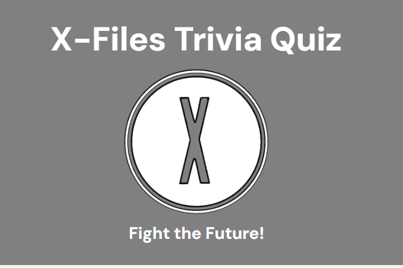
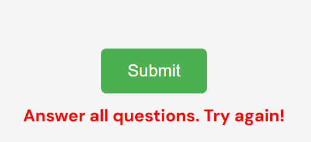
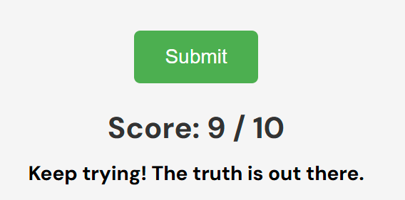
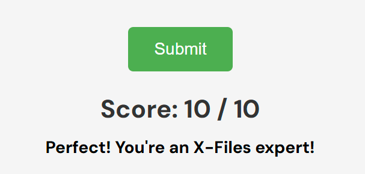
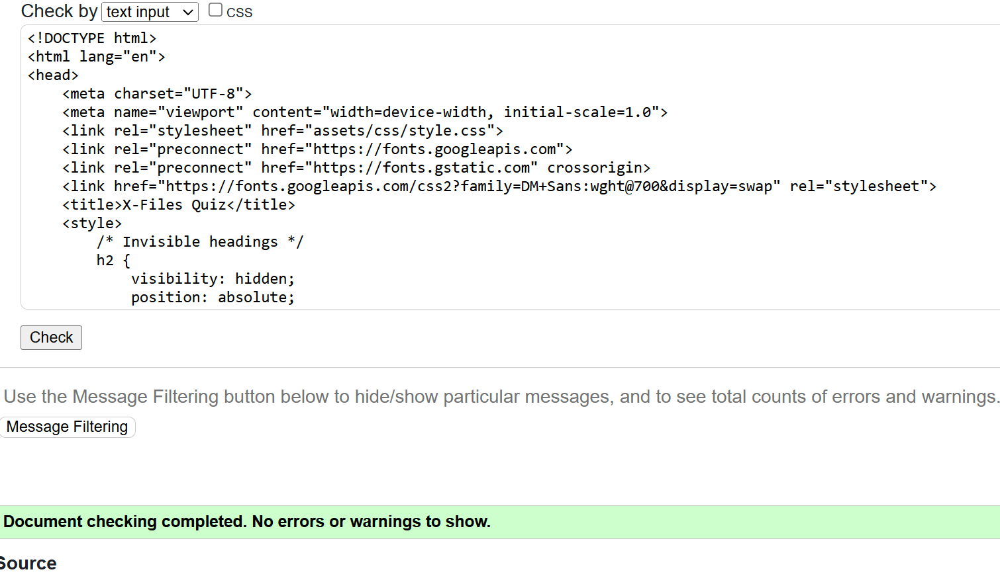
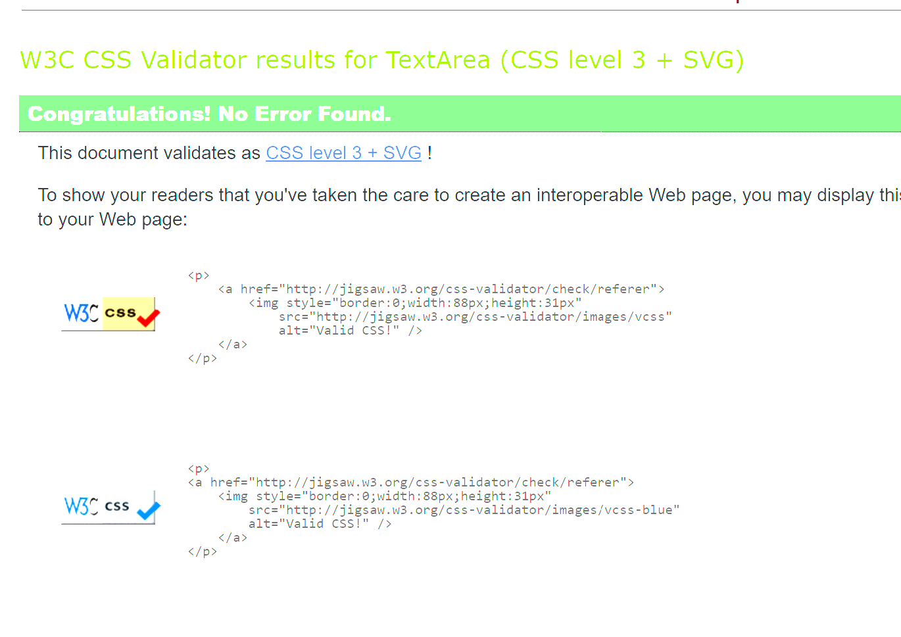
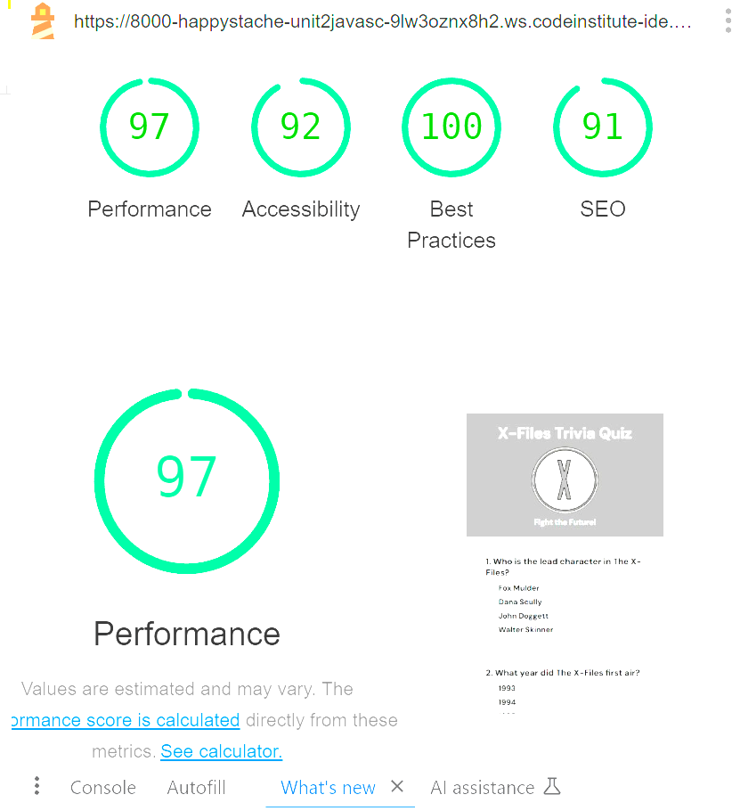

# The X-Files Quiz 

## Project Overview
The X-Files Quiz is a fan-inspired web application designed to test the knowledge of enthusiasts of the iconic television series *The X-Files*. Built with HTML, CSS, and JavaScript, the quiz combines a spooky, mysterious atmosphere with interactive elements. It offers a fun, engaging way for users to revisit the show's most memorable moments, characters, and plot twists, all while tracking their quiz performance. Whether you're a casual fan or a *X-Files* expert, this quiz will challenge your recall and keep you coming back for more.

## Features

### Existing Features

#### X-Files Logo and Header
Positioned prominently at the top of the page, the *X-Files* logo immediately sets the tone for the quiz, signaling to users that they’re about to embark on a mysterious journey through the world of *The X-Files*. The eerie design and bold font of the logo draw users in, adding to the immersive experience.

- **Design Details**: The logo is displayed in the upper-center of the page with ample spacing around it to ensure visibility and impact. The header contains a brief introduction to the quiz, hinting at the spooky and enigmatic nature of the questions.

#### Quiz Area
The quiz questions are displayed in a central container, each with radio button options for answers. This design makes it easy for users to engage with the quiz, keeping the focus on the content. Each question is presented clearly, with multiple choice answers allowing users to make a selection with a simple click.

- **Layout**: The questions and answer options are centrally aligned, with each answer provided as a clickable radio button. The design minimizes distractions, allowing the content to be the central focus while maintaining a user-friendly interface.

#### Responsive Layout
The quiz is designed to display in a two-column layout that adjusts dynamically to fit various screen sizes, ensuring that the quiz remains accessible on desktops, tablets, and mobile devices. This layout improves user experience by providing a seamless transition between different devices.

- **Mobile-First Design**: The quiz’s two-column layout adapts to smaller screen sizes by stacking elements vertically. This ensures a consistent experience across devices without the need for horizontal scrolling or misalignment of content.

#### Submit Button and Feedback
After selecting answers, users can click the “Submit” button to receive immediate feedback, including a score summary that tells them how many questions they answered correctly. The feedback is presented in a clear, easy-to-understand format to guide users through their performance.

- **Interactive Feedback**: Once submitted, a message appears showing how many questions were answered correctly. This reinforces user engagement and provides motivation for those who wish to retry and improve their score.

#### Score
A final score is shown after each quiz, giving users an idea of how well they did and encouraging replayability. Users can aim to improve their scores with each attempt. 

- **Scoring System**: The score is calculated based on the number of correct answers, with instant feedback on each submission. Users are encouraged to take the quiz multiple times to improve their scores.

### Features Left to Implement

- **Question Randomization**: Introduce functionality to randomize the question order each time the quiz is started, providing a new experience for repeat users. This would add variety and ensure that no two quiz sessions feel identical.
  
- **Timed Mode**: Add a timed option for users who want an extra challenge, simulating the intensity and urgency of an *X-Files* investigation. The timer would countdown as users select their answers, adding an element of suspense.

- **High-Score Storage**: Implement a feature to save high scores locally, allowing users to track their best results over time. This feature would create a sense of achievement and make the quiz more competitive.

## Testing

### HTML and CSS Validation
- **HTML**: All HTML code passed through the W3C HTML Validator without any errors, ensuring standards-compliance.
- **CSS**: CSS code passed validation using the W3C CSS Validator, confirming that all styles are syntactically correct.

### JavaScript Validation
- **JSHint**: The JavaScript code was validated using JSHint, with no major errors. Key metrics include:
  - 10 functions in total, with the largest function containing 12 statements.
  - Cyclomatic complexity values within manageable limits for readability and performance.

### Browser and Device Compatibility
The application was tested across various browsers, including Chrome, Firefox, and Safari, to confirm consistent behavior. Mobile responsiveness was tested on various devices, ensuring the layout remains functional across all screen sizes.

### Lighthouse Performance Metrics
Using Google Lighthouse, the application achieved high scores in the following areas:
- **Performance**: Efficient load times and resource usage.
- **Accessibility**: Accessible design with good contrast and screen reader support.
- **Best Practices**: High adherence to web performance and reliability standards.

## Known Bugs and Fixes

- **Radio Button Styling**: Initially, there were issues with radio button alignment across different browsers. This was fixed by standardizing button dimensions and spacing.
- **Responsive Layout Adjustments**: During testing on smaller screens, the two-column layout sometimes overlapped. Additional media queries resolved this, providing a balanced layout on all screen sizes.
- **Dynamic Question Generation**: Questions are now generated dynamically through JavaScript, allowing for more flexibility and easy updates. Previously, the questions were hard-coded into the HTML, which made it difficult to add or modify questions. The dynamic generation resolves this by creating questions programmatically based on a question array, enhancing scalability and ease of maintenance.

### Unfixed Bugs
No remaining bugs have been identified at this time, but further testing may uncover edge cases that need attention.

## Deployment
The X-Files Quiz is deployed on GitHub Pages, making it easily accessible to users worldwide. Deployment steps:
1. Navigate to the GitHub repository's Settings tab.
2. Under the Pages section, choose the Main branch for deployment.
3. The quiz can be accessed at: [Live Site](#).

## Credits

### Content
- The questions and trivia were adapted from *The X-Files* series and various fan sources, ensuring an authentic and comprehensive quiz experience.
- The quiz's design was inspired by standard JavaScript quiz tutorials and customized to match the eerie, mysterious tone of *The X-Files*.

### Media
- The *X-Files* logo and background images were sourced from free, open-source repositories, with attribution where required.

## Acknowledgments
Special thanks to the *X-Files* fan community for providing the inspiration and source material for the trivia questions.
